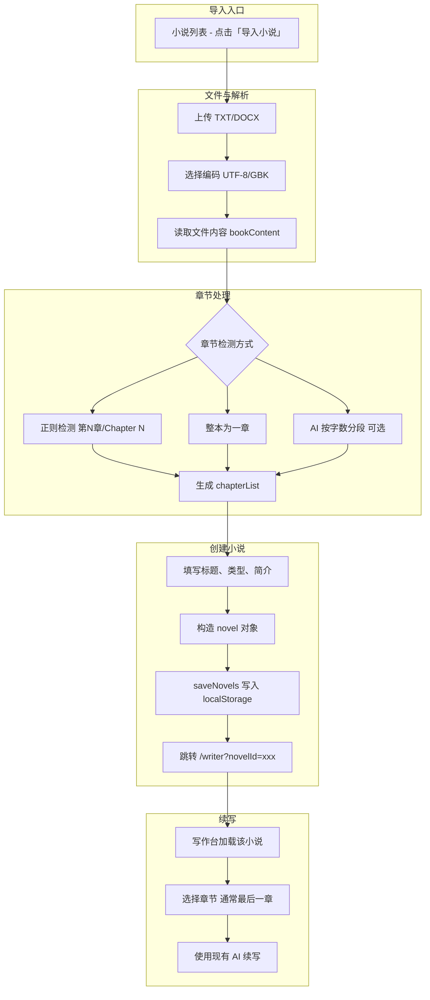

# 导入外部小说并续写 - 实现方案说明

基于现有项目分析，本文档说明如何以最小改动、最大复用实现「导入外部小说 → 进入写作台 → 续写」的完整流程。

---

## 一、目标与约束

| 项目 | 说明 |
|------|------|
| **目标** | 用户上传 TXT/DOCX 小说文件，解析为「小说 + 章节」并写入现有存储，然后进入写作台在最后一章（或任选一章）使用已有「AI 续写」能力继续写。 |
| **约束** | 小说数据存于 `localStorage.novels`；写作台通过 `route.query.novelId` 加载小说，使用 `novel.chapterList`、`novel.characters` 等；不改变现有 Writer 续写逻辑。 |

---

## 二、推荐方案概览

**推荐做法**：在 **小说列表（NovelManagement）** 增加「导入小说」入口，复用 **拆书工具（BookAnalysis）** 的文件解析与章节检测逻辑，生成符合现有结构的 `novel` 并 `saveNovels()`，再跳转写作台。

- **入口**：小说列表页「导入小说」按钮（或创建小说对话框内「从文件导入」）。
- **流程**：上传文件 → 选编码 → 解析文本 → 章节检测（正则 / 整本一章 / 可选 AI 分段）→ 填写标题与类型 → 生成 novel 并保存 → 跳转 `/writer?novelId=xxx`。
- **续写**：无需改写作台，用户进入后选最后一章（或任意章）使用现有「AI 续写」即可。

---

## 三、整体流程（Mermaid）



---

## 四、数据结构对齐

### 4.1 现有 novel 与 chapterList 结构（Writer / NovelManagement 使用）

- **novel**：`id`, `title`, `genre`, `description`, `cover`, `status`, `chapterList`, `wordCount`, `createdAt`, `updatedAt`, `writingRecords`, `genrePrompt`, `characters`, `worldSettings`, `corpusData`, `events`。
- **chapterList 单项**：`id`, `title`, `description`, `content`, `wordCount`, `status`（需为 `'draft'` 等，Writer 会校验）, `createdAt`, `updatedAt`。

导入时只需生成与上述一致的 `novel` 和 `chapterList`，Writer 和保存逻辑无需改动。

### 4.2 从「章节检测结果」生成 chapterList

拆书工具现有两种章节数据：

1. **正则检测**（`detectChapters`）：得到 `{ index, title, startLine, wordCount }`，**没有 startPos/endPos**，需用行号从 `bookContent` 按行切片取内容。
2. **AI 章节重置**：得到 `startPos` / `endPos`，可直接 `bookContent.slice(startPos, endPos)`。

生成单章内容的逻辑可与 BookAnalysis 中「获取选中章节内容」保持一致：

- 若有 `startPos`/`endPos`：`content = bookContent.slice(startPos, endPos)`。
- 若仅有 `startLine`：  
  `lines = bookContent.split('\n')`，  
  `endLine = nextChapter ? nextChapter.startLine : lines.length`，  
  `content = lines.slice(startLine, endLine).join('\n')`。

再将每章转为：

```js
{
  id: Date.now() + index,  // 或任意唯一 id
  title: chapter.title,
  description: '',
  content: content,
  wordCount: content.length,
  status: 'draft',
  createdAt: new Date(),
  updatedAt: new Date()
}
```

汇总为 `chapterList`，并计算 `novel.wordCount` 等。

---

## 五、可复用代码（拆书工具）

| 能力 | 位置 | 复用方式 |
|------|------|----------|
| 文件选择与编码 | `BookAnalysis.vue`：`handleFileChange`、`readFileContent`、`selectedEncoding` | 抽成 composable 或工具函数，供「导入小说」页/弹窗调用 |
| TXT 按编码读取 | `readFileContent` 内 `FileReader.readAsText(file, 'UTF-8'|'GBK')` | 同上 |
| 正则章节检测 | `detectChapters()`，正则 `/(第[一二三四五六七八九十百千万\d]+[章节]\|Chapter\s*\d+)/gi` | 同上，或直接复制到导入模块 |
| 按行/按 startPos-endPos 取章节内容 | `BookAnalysis.vue` 中 1106、1109–1113 行附近逻辑 | 封装为 `getChapterContent(chapter, bookContent, allChapters)`，返回该章正文 |

DOCX：当前拆书工具用 `readAsText` 读 DOCX，效果有限；若需真正解析 DOCX，可后续引入 `mammoth` 等库，与现有 TXT 路径并列。

---

## 六、推荐实现步骤

### 6.1 方案 A：在小说列表页增加「导入小说」弹窗（推荐）

1. **NovelManagement.vue**
   - 在列表头部增加按钮「导入小说」，点击后打开 `showImportDialog = true`。
   - 弹窗内：
     - 上传：`el-upload`（仅 TXT 或 TXT+DOCX），选择编码（UTF-8/GBK）。
     - 调用与 BookAnalysis 同逻辑的 `readFileContent`、`detectChapters`（或抽成 `useFileImport()` composable）。
     - 章节处理方式：单选 ——「自动检测章节（正则）」「整本作为一章」；可选提供「AI 按约 3000 字分段」（需调现有 AI 分段逻辑，与拆书一致）。
     - 展示解析结果：章节数、总字数、章节列表预览（标题 + 字数）。
     - 表单：小说标题（默认文件名）、类型、简介（可选）。
     - 确定：根据当前 `bookContent` 与章节列表生成 `chapterList`（用上文的 content 生成方式），构造 `novel`（与 `createNovel` 一致，仅 `chapterList`、`wordCount` 等来自导入），`novels.value.unshift(novel)`，`saveNovels()`，关闭弹窗并 `router.push('/writer?novelId=' + novel.id)`。
2. **复用与抽取**
   - 将「读文件 + 编码 + 章节检测」抽到 `composables/useFileImport.js`（或 `utils/importNovel.js`），返回 `{ bookContent, detectedChapters, encoding, readFile, detectChapters }`，BookAnalysis 与 NovelManagement 共用，减少重复。
3. **Writer**
   - 无需修改；进入写作台后选最后一章点「AI 续写」即完成续写流程。

### 6.2 方案 B：在拆书工具增加「导入为小说并续写」

1. **BookAnalysis.vue**
   - 在已有「上传 → 解析 → 章节选择」之后，增加按钮「导入为小说并续写」。
   - 根据当前 `bookContent`、`detectedChapters`（或 `aiDetectedChapters`）以及用户选中的章节（或全选），用同一套「按行/按 startPos-endPos 取内容」逻辑生成 `chapterList`。
   - 弹窗填写标题、类型、简介，构造 `novel`，从 localStorage 读取 `novels`，`unshift(novel)`，`saveNovels()`，再 `router.push('/writer?novelId=' + novel.id)`。
2. **优点**：用户可在拆书分析前/后，直接把当前文件变为小说并去续写。  
3. **缺点**：入口在「拆书工具」，与「小说列表」的创作动线略分离；若希望「创作入口统一在小说列表」，仍建议以方案 A 为主。

---

## 七、章节检测策略建议

| 策略 | 适用场景 | 实现 |
|------|----------|------|
| **正则检测** | 文件中有「第X章」「Chapter N」等 | 直接复用 `detectChapters()`，再按 4.2 生成带 `content` 的 chapterList。 |
| **整本一章** | 无章节标题、短篇或希望整体续写 | `chapterList = [{ id, title: '全文', content: bookContent, wordCount, status: 'draft', ... }]`。 |
| **AI 分段（可选）** | 无章节但希望按字数分段 | 复用拆书中「AI 章节重置」逻辑（约 3000 字/章，按句号/双换行断句），得到 `startPos/endPos` 再生成 chapterList。 |

建议首期实现「正则检测」+「整本一章」即可满足大部分导入续写需求；AI 分段可作为增强项。

---

## 八、注意事项

1. **编码**：TXT 必须支持 UTF-8 与 GBK（与拆书一致），避免乱码。
2. **章节 id**：保证唯一即可，例如 `Date.now() + index` 或 `'import_' + index`。
3. **存盘**：只调用现有 `saveNovels()`，不新增存储格式。
4. **Writer 兼容**：`chapter.status` 至少为 `'draft'`，避免写作台里被当作非法状态。
5. **大文件**：若单章或整本过大，可考虑在导入前限制字数或提示「建议分段导入」，避免单章体积过大影响续写体验。

---

## 九、小结

- **做什么**：在小说列表（或拆书工具）增加「导入小说」流程，把外部 TXT/DOCX 解析成 `novel + chapterList` 写入 `localStorage.novels`，再跳转写作台；续写使用现有 AI 续写即可。
- **怎么做**：复用拆书工具的文件读取与章节检测逻辑，按现有 novel/chapterList 结构生成数据并 `saveNovels()`，不改 Writer。
- **推荐**：优先在 **NovelManagement** 做「导入小说」弹窗（方案 A），必要时再在拆书工具加「导入为小说并续写」（方案 B）作为补充入口。

按上述方案即可在现有架构下以较小成本实现「导入外部小说并对小说进行续写」的完整功能。
