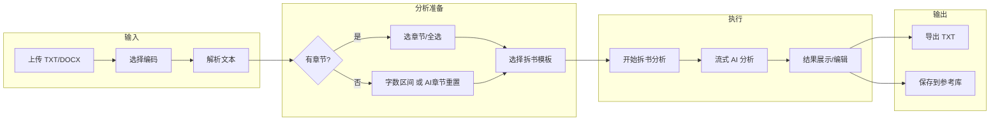

# 91Writing 拆书功能说明

## 一、功能概述

**拆书**（Book Analysis）是 91Writing 中的「拆书工具」模块，用于对导入的小说文本进行 AI 驱动的深度分析，帮助写作者学习优秀作品的写作技法、结构、人物与语言风格，并支持按章节查看、简读与导出。

- **入口**：侧边栏「拆书工具」→ 路由 `/book-analysis`
- **主视图**：`src/views/BookAnalysis.vue`

---

## 二、核心流程

---

## 三、功能模块详解

### 3.1 导入小说

| 项目 | 说明 |
|------|------|
| **支持格式** | `.txt`、`.docx` |
| **编码** | UTF-8、GBK/GB2312（仅 TXT 可选；DOCX 使用默认编码） |
| **交互** | 拖拽或点击上传；上传后可「重新读取」或切换编码后重读 |
| **实现** | `el-upload` 不自动上传，由 `handleFileChange` → `readFileContent` 用 `FileReader` 按所选编码读取；TXT 用 `readAsText(file, 'UTF-8'|'GBK')` |

上传成功后会自动做**章节检测**（见下），并清空之前的分析结果与章节选择。

### 3.2 章节检测与范围选择

**两种章节来源：**

1. **正则章节检测**（`detectChapters`）  
   - 上传后自动执行。  
   - 正则：`/(第[一二三四五六七八九十百千万\d]+[章节]|Chapter\s*\d+)/gi`，按匹配行切分为章节，记录 `index、title、startLine、wordCount`。

2. **AI 章节重置**（`startAiChapterDetection`）  
   - 当未检测到章节或用户主动点击「AI章节重置」时使用。  
   - 按约 3000 字/章在句号或双换行处断句，生成 `startPos/endPos` 的章节列表；简读初始为空，可在「查看简读」里对单章调用 AI 生成。

**分析范围：**

- **有章节时**：多选章节（支持全选/清空），只对选中章节拼接后的文本做拆书分析。  
- **无章节时**：  
  - 用「起始字数」～「结束字数」区间；或  
  - 先点「AI章节重置」再选章节。

章节列表支持「查看内容」（弹窗内选章查看/复制/导出单章）、「查看简读」（仅 AI 章节时可用，进入章节简读管理）。

### 3.3 拆书模板

- **来源**：  
  - **内置模板**（`defaultAnalysisTemplates`）：综合拆书分析、结构分析专项、人物塑造分析、语言风格分析、情节技巧分析。  
  - **提示词库**：`localStorage` 中 `category === 'book-analysis'` 的提示词会合并到模板列表（同见 `PromptsLibrary.vue` 中 `book-analysis` 分类）。  
- **加载**：`loadAnalysisTemplates()` 在 `onMounted` 时执行，先读 localStorage，有则与内置模板合并，无则仅用内置。  
- **使用**：用户选一个模板后点击「开始拆书分析」，该模板的 `content`（含 `{小说内容}` 等占位）会与当前分析范围、章节信息一起拼成最终发给 AI 的 prompt。

### 3.4 分析设置与执行

- **必选**：拆书模板（未选时按钮禁用）。  
- **可选**：章节多选 或 字数区间（无章节时）。  

**执行步骤**（`startAnalysis`）：

1. 文本预处理（进度 10%）。  
2. 准备分析数据（20%）：`prepareAnalysisData()` 根据选中的章节或字数区间截取 `textToAnalyze`，并整理 `chapterInfos`、模板、文件名、编码、总字数等。  
3. AI 深度分析（40%→100%）：调用 `generateAnalysisResult(analysisData)`，内部使用 **流式 API** `novelStore.generateContentWithAPIStream(..., prompt, 4000, onChunk)`，实时把 AI 生成内容追加到报告正文；进度随字数增长在 40%～95% 之间变化，并自动滚动到底部。  
4. 报告格式：先写入固定「报告头」（分析时间、模板、文件、字数、章节概况等），再流式追加 AI 正文，最后写入「报告尾」（完成提示、技术信息）。

结果展示在右侧多行文本框，可编辑；分析完成后可「导出分析结果」或「保存到参考库」。

### 3.5 章节简读（AI 章节管理）

仅当存在 **AI 检测的章节** 时可用「查看简读」：

- **章节简读对话框**：左侧章节列表，右侧当前章「完整内容」+「章节简读」两个标签页。  
- **简读生成**：  
  - 使用本地可编辑的「AI解读提示词」模板，支持占位符：`{章节标题}`、`{章节字数}`、`{章节内容}`。  
  - 可「预览完整提示词」、复制；可「重置默认」提示词。  
  - 点击「调用AI解读」会 `buildFullPrompt()` 替换占位符后，调用 `novelStore.generateContent(prompt)` 生成简读并写回当前章的 `summary`。  
- **导出**：可导出当前章（完整内容/简读）、导出所有简读汇总、导出所有章节完整内容。

章节简读的提示词模板会通过 `watch` 自动保存到 `localStorage`（`chapterSummaryPromptTemplate`），下次打开会恢复。

### 3.6 导出与参考库

- **导出分析结果**：将当前分析报告（含报告头、AI 正文、报告尾）导出为 `.txt`，文件名形如 `拆书分析结果_时间戳.txt`。  
- **保存到参考库**：当前实现仅弹出「已保存到拆书参考库！」提示，**尚未实现持久化存储**；README 中描述的「拆书参考库」为规划能力，后续可在此处接入真实存储（如 localStorage 或后端）。

---

## 四、与提示词库的联动

- **拆书模板**：提示词库中 `category === 'book-analysis'` 的条目会在拆书页「拆书模板」下拉框中与内置模板一起展示，选后作为分析 prompt 的模板内容。  
- **模板结构**：每条模板有 `id、name、icon、description、content`；`content` 中可包含 `{小说内容}` 等占位，在 `generateAnalysisResult` 中与 `textToAnalyze`、章节信息等一起拼成最终 prompt。

---

## 五、API 与状态依赖

- **流式拆书分析**：`novelStore.generateContentWithAPIStream('', '', prompt, 4000, onChunk)`，依赖已配置的 API（官方 91 Writing 或自定义 OpenAI 兼容）。  
- **章节简读**：`novelStore.generateContent(prompt)`，同样依赖上述 API。  
- **前置条件**：需在「设置」中配置 API，否则会报「请先配置API」类错误。

---

## 六、文件与路由

| 类型 | 路径/说明 |
|------|------------|
| 视图 | `src/views/BookAnalysis.vue` |
| 路由 | `src/router/index.js`：`path: 'book-analysis'`, `name: 'BookAnalysis'` |
| 侧栏 | `src/views/Dashboard.vue`：「拆书工具」→ `/book-analysis` |
| 提示词分类 | `src/views/PromptsLibrary.vue`：`category: 'book-analysis'` |

---

## 七、小结

拆书功能实现了一条从「上传小说 → 选范围（章节/字数/AI 章节）→ 选模板 → 流式 AI 分析 → 编辑/导出」的完整链路，并在此基础上提供 AI 章节简读与多维度导出。当前「保存到拆书参考库」仅为 UI 提示，如需真正参考库能力，需在 `saveToLibrary` 中增加持久化逻辑。

---

## 八、基于拆书导入小说库并实现续写的可行性分析

### 8.1 结论

**可以实现。** 在拆书页已有「上传 → 解析全文 → 章节检测（正则或 AI）」的前提下，只需增加「导入到小说库」流程，将当前 `bookContent` + `detectedChapters` 转成小说库所需的数据结构并写入 `localStorage`，即可在小说列表中看到新小说，进入写作页进行**续写**。续写能力已存在于 Writer 模块，无需改续写逻辑，只要数据格式符合即可。

### 8.2 小说库与写作页的数据依赖

| 来源 | 说明 |
|------|------|
| **小说列表** | `localStorage['novels']`，数组；每项为一部小说的元数据 + `chapterList`。 |
| **单部小说** | 至少包含：`id`、`title`、`description`、`genre`、`status`、`chapterList`、`wordCount`、`updatedAt`、`characters`、`worldSettings`、`corpusData`、`events` 等（参见 `NovelManagement.vue` 创建表单与 `Writer.vue` 的 `saveNovelData`）。 |
| **章节** | `chapterList[]` 每项：`id`、`title`、`description`（大纲）、`content`（正文）、`status`（如 `draft`/`completed`）、`wordCount`、`createdAt`、`updatedAt`。Writer 通过 `content = chapter.content` 加载当前章，续写时基于 `currentNovel`（标题/类型/简介）和当前章 `content` 调用 API。 |

因此：**只要构造出符合上述结构的 `novel` 和 `chapterList`，写入 `novels` 并跳转到 `/writer?novelId=xxx`，即可直接使用现有续写功能。**

### 8.3 拆书侧已有数据 → 小说库的映射

| 拆书侧 | 小说库侧 | 说明 |
|--------|----------|------|
| `bookContent` | 各章节 `content` | 按章节起止位置从 `bookContent` 截取；正则章节用 `startLine`/下一章 `startLine` 按行截取，AI 章节用 `startPos`/`endPos` 按字符截取。 |
| `detectedChapters` | `chapterList` | 每章：`id` 可用序号或 `Date.now()+index`；`title` 直接取；`description` 可用 AI 章节的 `summary` 或空字符串；`content` 为上面截取的纯文本（写作页编辑器接受纯文本或简单 HTML）；`status` 建议 `'draft'` 或 `'completed'`；`wordCount` 已有；`createdAt`/`updatedAt` 为 `new Date()`。 |
| 文件名 / 用户输入 | `title` | 默认可用 `uploadedFile.name` 去掉扩展名，或弹窗让用户填标题、简介、类型。 |
| — | `id`、`genre`、`description`、`cover`、`characters` 等 | 新小说：`id` 用 `Date.now()`；`genre` 用户选择或默认；`description` 可选；`cover` 可空；`characters`/`worldSettings`/`corpusData`/`events` 空数组。 |

**无章节时的 fallback**：若未检测到任何章节，可生成一条「全书」章节：`chapterList = [{ id: 1, title: '全文', content: bookContent, ... }]`，用户仍可在写作页从最后一章续写。

### 8.4 实现要点（建议）

1. **入口**：在 `BookAnalysis.vue` 左侧操作区（例如「分析设置」下方或与「开始拆书分析」并列）增加按钮「**导入到小说库**」。
2. **前置条件**：存在 `bookContent`；若存在 `detectedChapters` 则按章导入，否则按「全书单章」导入。
3. **交互**：点击后弹出简单表单：小说标题（默认文件名）、简介（可选）、类型（下拉，与 `NovelManagement` 的 `genrePresets` 一致）。确认后执行映射并写入 `localStorage['novels']`，提示「已导入，是否前往续写？」并可选跳转 `router.push('/writer?novelId=' + newNovel.id)`。
4. **章节内容格式**：当前 Writer 的 `chapter.content` 可为纯文本或 HTML；为简单起见，导入时用**纯文本**即可（每段可用 `\n\n` 分隔），写作页会正常显示；若希望首屏更美观，可对 `\n\n` 转成 `
...
` 再存。
5. **去重**：若希望避免重复导入同一文件，可对「标题 + 字数」做简单校验或生成唯一 id 后覆盖旧条目，按产品需求决定。

### 8.5 边界与注意点

- **编码**：拆书已支持 UTF-8/GBK，导入到小说库的 `bookContent` 已是解码后的字符串，无需再处理编码。
- **大文件**：`localStorage` 有约 5MB 限制，超长小说可能无法整本存入；可提示用户或只导入前 N 章/前若干万字。
- **Writer 续写条件**：续写要求当前章已有不少于约 50 字内容（见 Writer 中 `content.value.trim().length < 50` 的校验），导入的章节通常都满足；若用户删成空章再续写，会继续走现有的「请先写一些内容」提示。

### 8.6 流程小结（Mermaid）

结论：**在拆书功能上增加「导入到小说库」并接上现有写作页与续写逻辑，技术上完全可行，且改动集中在拆书页的导入逻辑与数据结构转换，无需改动 Writer 的续写实现。**
