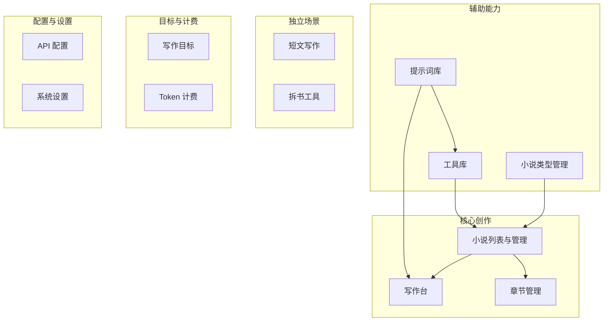
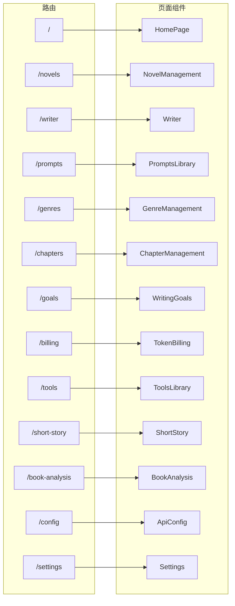
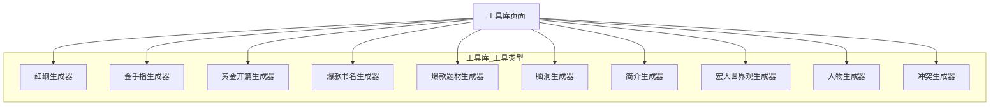
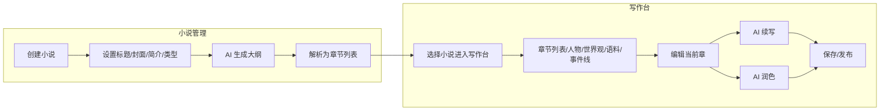
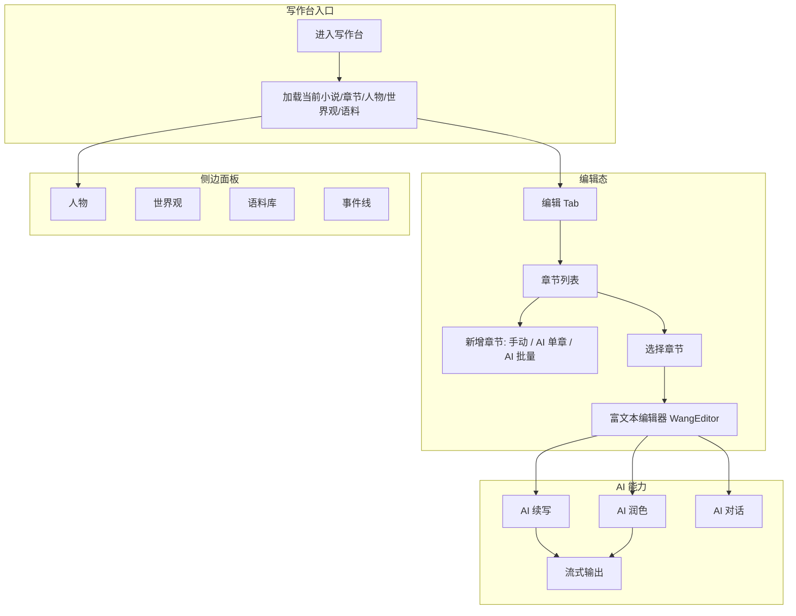
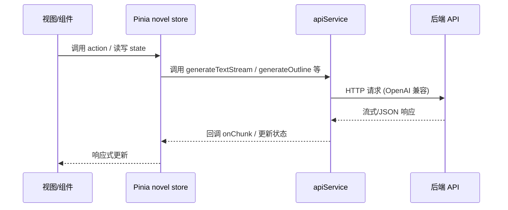
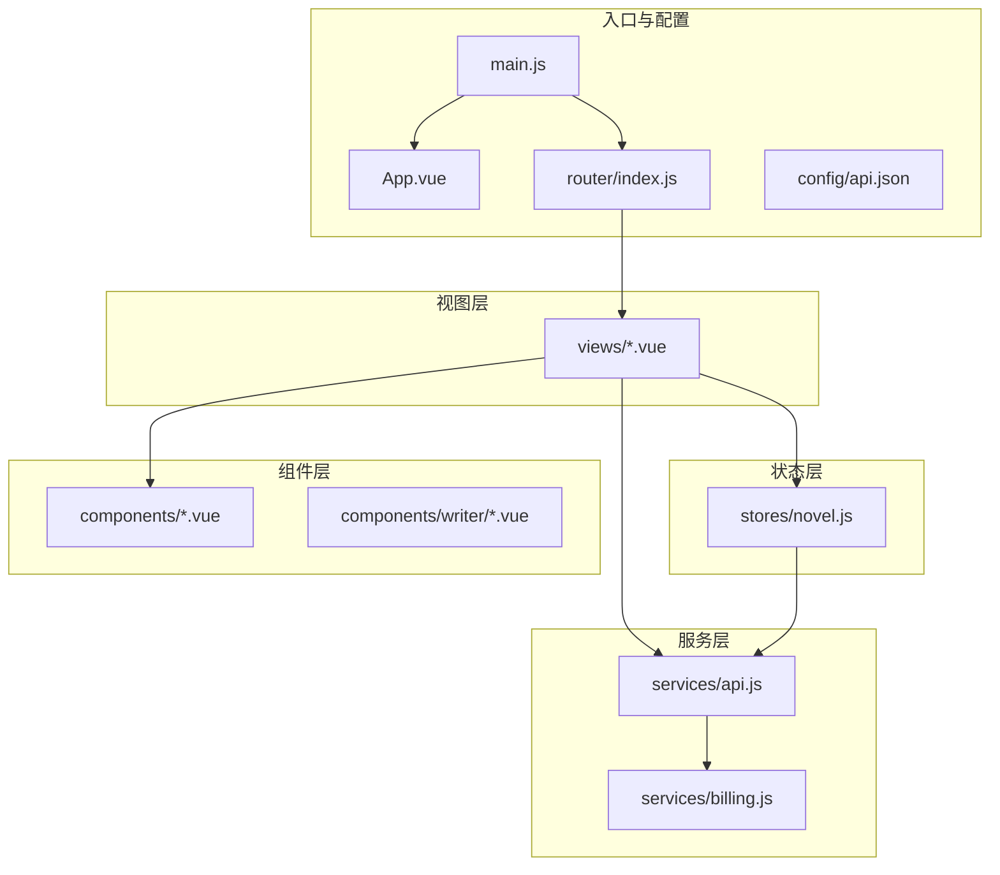
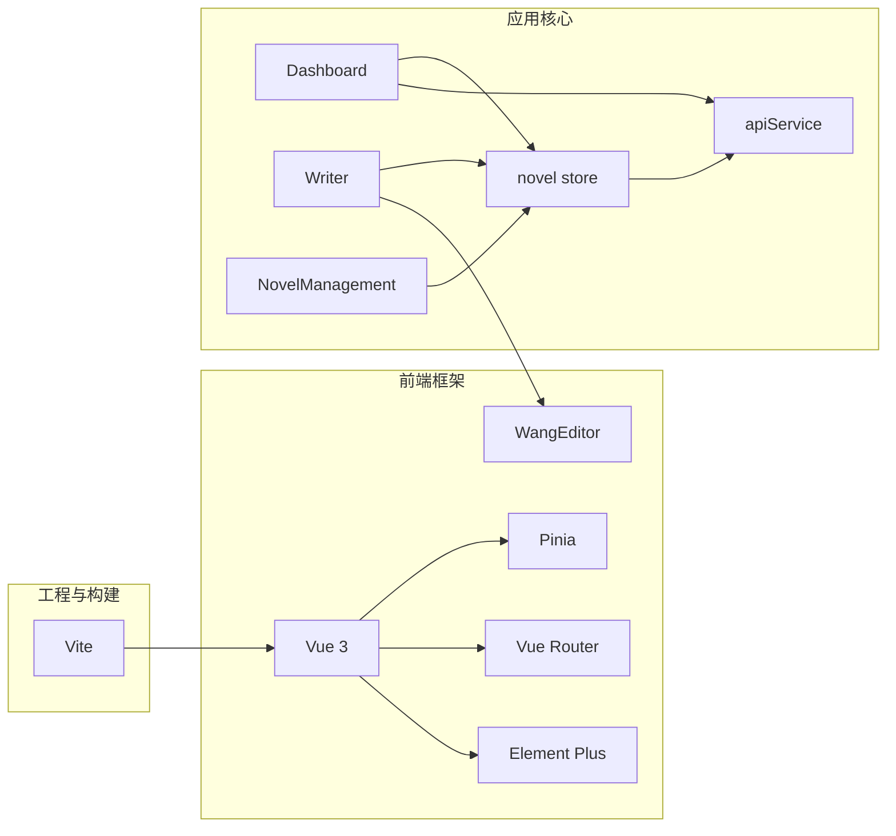
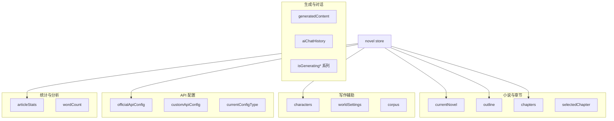

# 91Writing 项目功能与架构说明

本文档从功能、流程、架构三方面分析 91Writing（91 写作）项目，并辅以 Mermaid 图表说明。

---

## 一、项目概述

**91Writing** 是一款基于 AI 的网文创作工具，使用 Vue 3 构建，提供从大纲生成、章节写作、短文创作到拆书分析的全流程能力。支持官方 91 写作 API 与自定义 OpenAI 兼容 API 双配置。

- **Demo**：https://xiezuo.91hub.vip
- **技术栈**：Vue 3、Vite、Pinia、Vue Router、Element Plus、WangEditor

---

## 二、主要功能模块

### 2.1 功能模块总览

### 2.2 路由与页面对应关系

### 2.3 工具库（ToolsLibrary）子功能

工具库提供 10 类 AI 辅助工具，用于选题、设定与内容灵感：

---

## 三、核心业务流程

### 3.1 小说从创建到写作的整体流程

### 3.2 写作台（Writer）内部流程

### 3.3 数据流：用户操作 → Store → API

---

## 四、技术架构

### 4.1 项目目录与分层

### 4.2 核心依赖关系

### 4.3 状态管理（Pinia novel store）结构概览

---

## 五、API 服务能力概览

`services/api.js` 对外提供的主要能力（与功能、流程对应）：

| 能力           | 方法示例                     | 用途说明               |
|----------------|------------------------------|------------------------|
| 通用文本生成   | `generateText` / `generateTextStream` | 续写、润色、短文等流式/非流式 |
| 大纲           | `generateOutlineStream`       | 小说大纲流式生成       |
| 章节正文       | `generateChapterContentStream`| 写作台单章/批量写正文  |
| AI 对话        | `chatWithAI`                  | 写作台内 AI 对话       |
| 摘要/建议      | `generateSummary` / `getWritingAdvice` | 摘要、写作建议     |
| 文章分析       | `analyzeArticle`              | 统计、情感、标签、评分 |
| 人物/世界观    | `generateCharacter` / `generateWorldSetting` | 工具库或写作台设定 |
| 个性化生成     | `generatePersonalizedContent` | 结合语料库风格生成     |

---

## 六、小结

- **功能**：以小说列表与写作台为核心，配合提示词库、类型管理、工具库（10 类）、短文写作、拆书工具、写作目标与 Token 计费，并由 API 配置与系统设置支撑。
- **流程**：从「创建小说 → 生成大纲 → 解析章节 → 进入写作台 → 编辑/续写/润色 → 保存发布」形成主链路；拆书、短文、工具库为独立或辅助链路。
- **架构**：Vue 3 + Vite + Pinia + Vue Router + Element Plus，单 store（novel） + 统一 apiService，流式调用与 Token 计费在 `api.js` / `billing.js` 中完成。

更细的拆书流程与界面说明见 [拆书功能说明](./拆书功能说明.md)。
